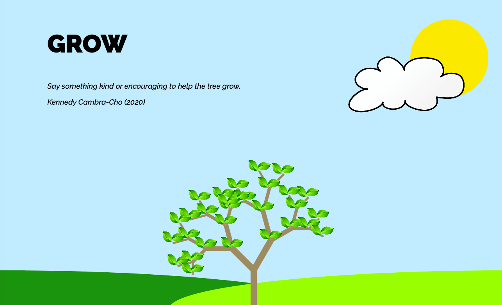
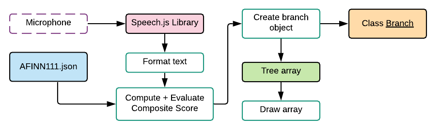
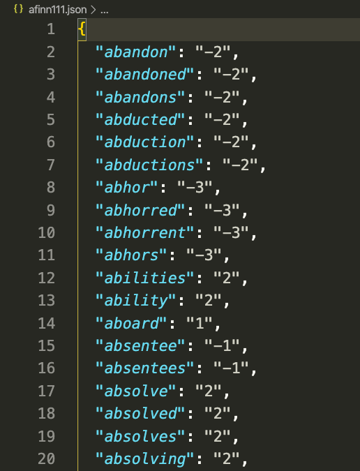
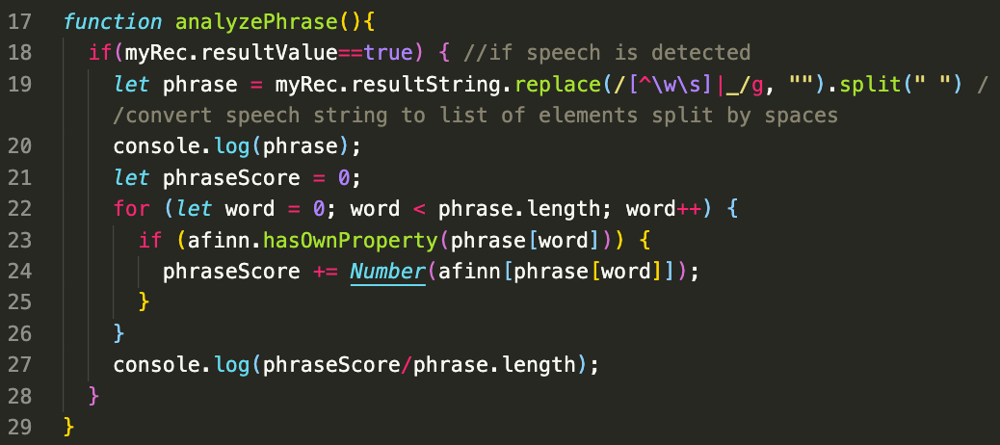
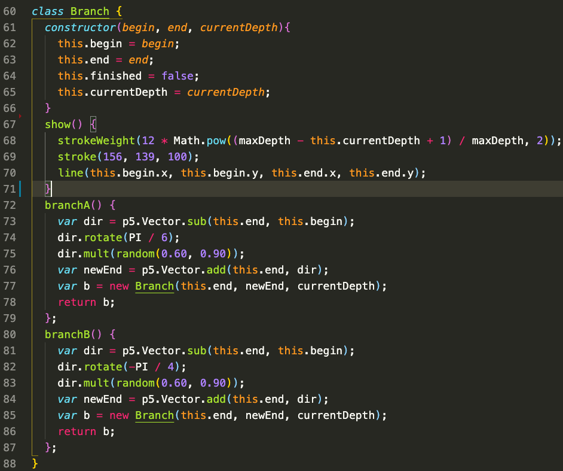

# GROW
## Kennedy Cambra-Cho
### Creative Coding Lab 2020
#### Interactive Media Arts, NYU Shanghai
---
# Concept

<table border="0">
 <tr>
    <td></td>
    <td><i style="font-size:10px">This project attempts to depict the relationship between positivity and progress using the speech library and sentiment analysis. The p5 sketch will depict a seedling that will progress or regress depending on the users’ input. If the speech is positive it will lead to growth while negative speech will cause decay.    (Cambra-Cho, 2020) </i></td>
 </tr>
</table>

# Inspirations

  

# Network Diagram

  

# Code
<table border="0">
 <tr>
    <td></td>
    <td></td>
    <td></td>
 </tr>
</table>

# Presentation
[Google Slides Presentation](https://docs.google.com/presentation/d/1vzdWM7F2UvKDpGb7jWu0XVwuCIfXm26jVIHYnx1K7zs/edit?usp=sharing)

# Final Implementation
[Demo Video](https://drive.google.com/file/d/1xuiV8lbkTCS15xzQaQcYjHr7yhnBOpvM/view?usp=sharing)
[Working Demo](ccl-final-spring2020.now.sh)

# References
* [p5.speech](https://idmnyu.github.io/p5.js-speech/)  
* [It's True—You Really Should Talk to Your Plants](https://www.thespruce.com/should-you-talk-to-your-plants-3972298)  
* [Tree Generation](https://devpost.com/software/realistic-tree-generation-with-the-lindenmayer-system)  
* [Animated Fractal Tree](https://www.youtube.com/watch?v=DTTZDMnyFco)
* [Animated Fractal Tree GitHub](https://github.com/someuser-321/TreeGenerator)